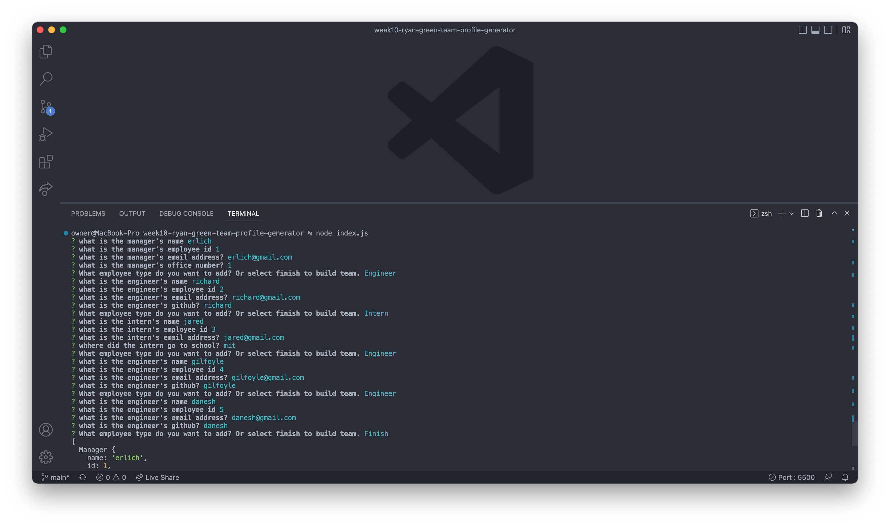

# week10-ryan-green-team-profile-generator

## Description

This was a command line app for generating an html page with cards for each employee created from the terminal using inquirer inputs. It was a good oppurtunity to use classes for the different employee types. I also had some practice with unit testing because each class had a seperate test.

## Installation

If you have node installed and the code from github you can run "node index.js" from the terminal.

## Usage

Link to a video showcasing the functionality.

## Tests

There is a unit test for all the Employee, Engineer, Intern, and Manager in the tests directory
